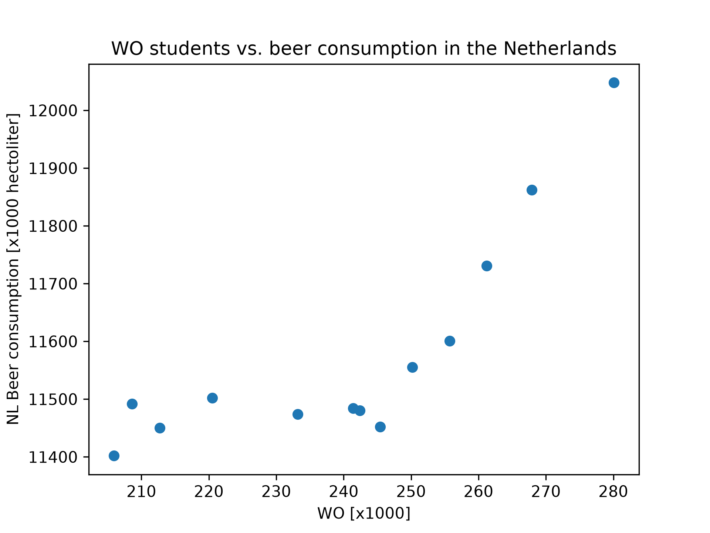

14023156

MCC Van Dyke et al., 2019 - The Rise of Coccidioides: Forces Against the Dust Devil Unleashed
JT Harvey, Applied Ergonomics, 2002 - An analysis of the forces required to drag sheep over various surfaces
DW Ziegler et al., 2005 - The neurocognitive effects of alcohol on adolescents and college students

There seems to be a positive correlation between amount of students and beer consumption. However, the time variable is not included , so maybe this is correlation but not causation. 